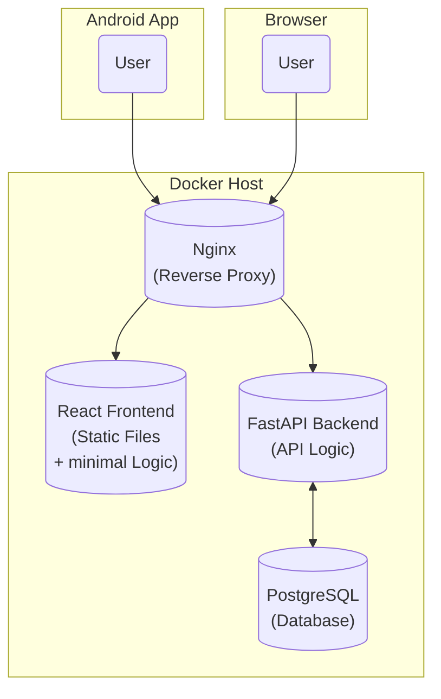
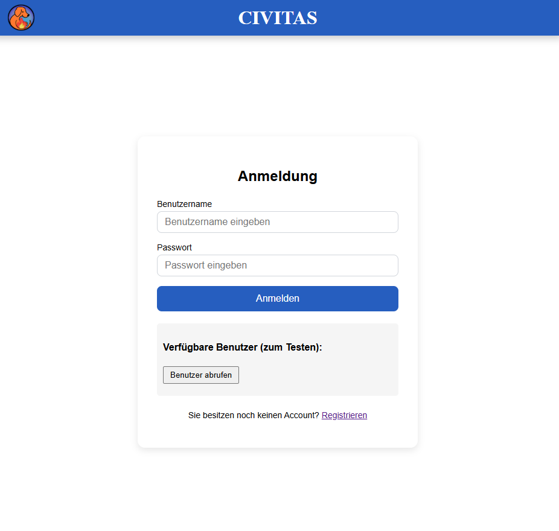

# Civitas

[](https://cau-git.rz.uni-kiel.de/ifi-ag-se/softwareprojekt/lms8_eg_017/civitas/-/commits/main)
[](https://cau-git.rz.uni-kiel.de/ifi-ag-se/softwareprojekt/lms8_eg_017/civitas/-/pipelines)


The **Civitas** application is a full-stack application designed to create, view, and manage applications for municipal registry services.

For citizens, it provides an easy way to submit applications online, either via the web interface or using the Android app; it also allows them to track the status of their applications or edit pending applications.

For municipal employees, it offers tools to review, approve, or reject applications, as well as set specific applications to "public" so that all citizens can view them.

Finally, it includes a reporting feature, allowing an otherwise unprivileged user to view all objects of the municipality's *Civitas* instance.


[[_TOC_]]


## Features

The web application includes the following functionality:

- **Secure authentication & authorization**  
  Modern registration and login system with role-based access control (RBAC).

- **Role-specific workflows**  
  Three user roles – **Admin**, **Applicant**, and **Reporter** – each with tailored dashboards, permissions, and feature sets.

- **Application lifecycle management**  
  Applicants can submit, track, and update requests; Admins can review, process, and manage records. Reporters can view all applications.

- **RESTful API**  
  Standards-compliant endpoints providing structured CRUD operations, designed for future integration with third-party systems.

- **Cloud-ready containerization**  
  Fully Dockerized environment for streamlined local development, CI/CD pipelines, and production deployment.


## Technology Stack



## How to access the Demo Instance

Make sure you are connected to the [university VPN via FortiClient.](https://www.rz.uni-kiel.de/de/tipps/vpn) 
You can access the demo instance of the Civitas application at:
[Civitas Web App (running on VM)](http://134.245.1.240:1203/)


For testing purposes, you can use the following test accounts:

| Username | Password | Role      |
| -------- | -------- | --------- |
| `demo`   | `demo`   | APPLICANT |
| `admin`  | `admin`  | ADMIN     |
| `rasenderreporter` | `rasenderreporter` | REPORTER  |



*Use the test accounts provided above to log in.*

## Deploy CIVITAS using Docker

To deploy the Civitas application using Docker, follow these steps:

1. Clone the repository:

```bash
git clone https://cau-git.rz.uni-kiel.de/ifi-ag-se/softwareprojekt/lms8_eg_017/civitas.git
cd civitas
```

2. Ensure you have Docker and Docker Compose installed on your machine.

```bash
docker --version
docker-compose --version
```

>[!TIP] Installing Docker
> For Windows, it's vital to install [Docker Desktop](https://www.docker.com/products/docker-desktop/). Follow the installation instructions on the Docker website. <br>
> Other systems can refer to the [official Docker installation guide](https://docs.docker.com/get-docker/).


3. From the root directory of the project, run the following command to build and start the containers:

```bash
docker-compose up --build
```

This command will build the Docker images.
**CIVITAS** is a three-container application consisting of:
- **Frontend**: React application served by Nginx
- **Backend**: FastAPI application
- **Database**: PostgreSQL database

4. Once the containers are up and running, you can access the Civitas application in your web browser at:

```bash
http://localhost:8083
```


### Docker Scripts

```bash
# Development
docker-compose -f docker-compose.dev.yml up --build
docker-compose -f docker-compose.dev.yml down

# Production
docker-compose up --build
docker-compose down

# View logs
docker-compose logs -f
```

## The CIVITAS RestAPI

The backend API is built using FastAPI and provides a rich Swagger UI for easy exploration and testing of endpoints.

### Users

- `GET /api/v1/users` - Get all users
- `POST /api/v1/users` - Create new user
- `GET /api/v1/users/:id` - Get user by ID
- `PUT /api/v1/users/:id` - Update user
- `DELETE /api/v1/users/:id` - Delete user

### Health Check

- `GET /health` - Server health status

## Troubleshooting Common Problems

### When the Frontend Won't Start

If you're having trouble getting the React app to start:

1. Delete the `node_modules` folder
2. Run `npm install` again
3. Try `npm start` again

### Port Conflicts

Sometimes other programs are using the same ports:

```bash
# See what's using port 3000 or 3001
netstat -tulpn | grep :3000
netstat -tulpn | grep :3001

# You might need to stop other services or change the port numbers
```

### Docker Problems

If Docker isn't working properly:

```bash
# Clean up Docker
docker system prune -a

# Rebuild everything from scratch
docker-compose build --no-cache
```

### API Not Working  

If the frontend can't connect to the backend:

- Make sure the backend server is running on port 3001
- Check that CORS is configured correctly
- Look at the API_BASE_URL setting in `src/utils/api.js`

## Deployment Notes

### For Production Deployment

If you want to deploy this for real use:

1. Build the production version:

   ```bash
   docker-compose -f docker-compose.yml up --build -d
   ```

2. Set up environment variables by creating a `.env` file:

   ```
   REACT_APP_API_URL=https://your-api-domain.com
   NODE_ENV=production
   PORT=3001
   ```

3. The nginx configuration is already included for serving the app

4. You would need to add SSL certificates for HTTPS in a real deployment
